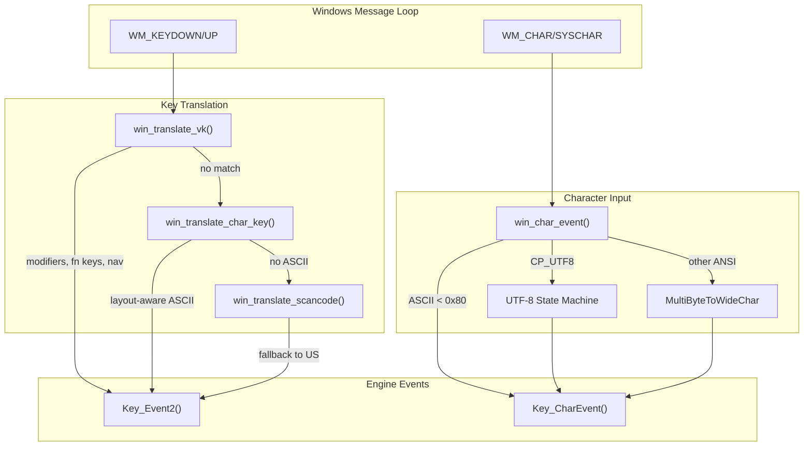

# Windows Keyboard Language Support Analysis

## Overview

The WORR-2 project has a custom Windows keyboard implementation that bypasses SDL for more direct control. The implementation resides primarily in:

- [client.c](file:///c:/Users/djdac/source/repos/WORR-2/src/windows/client.c) - Windows-specific input handling
- [keys.cpp](file:///c:/Users/djdac/source/repos/WORR-2/src/client/keys.cpp) - Client-side key event processing

Recent updates (documented in `doc/windows-keyboard-*.md`) added layout-aware translation, UTF-8 handling, and Unicode support. This analysis identifies remaining issues and potential improvements.

---

## Architecture Summary



---

## Issues Identified

### 1. **Dead Key Handling is Incomplete**

**Location**: [win_translate_char_key()](file:///c:/Users/djdac/source/repos/WORR-2/src/windows/client.c#L719-L747)

```c
UINT mapped = MapVirtualKeyEx((UINT)wParam, MAPVK_VK_TO_CHAR, layout);
// ...
if (mapped & 0x8000) {
    mapped &= 0x7FFF;  // Strips dead key marker, keeps base character
}
```

> [!WARNING]
> **Problem**: Dead keys (e.g., `^` on FR layout to produce `ê`) produce a character with `0x8000` bit set. The current code strips this flag and uses the base character, which may interfere with multi-key sequences expected by `WM_CHAR`.

**Impact**: On layouts like French, German, or Spanish, pressing a dead key followed by a vowel may not produce the expected accented character in bindings, and may cause double-input in text fields.

**Recommended Fix**:
- Return 0 for dead keys in `win_translate_char_key()` so they fall back to scancode translation
- Dead key composition will then be handled entirely by `WM_CHAR`

```diff
 if (mapped & 0x8000) {
-    mapped &= 0x7FFF;
+    return 0;  // Let WM_CHAR handle composed characters
 }
```

---

### 2. **No AltGr Awareness in Key Translation**

**Location**: [win_translate_vk()](file:///c:/Users/djdac/source/repos/WORR-2/src/windows/client.c#L749-L885)

**Problem**: AltGr (Right Alt on European keyboards) is treated as `K_RALT`, but no special handling exists for:
- Distinguishing AltGr key combinations from Ctrl+Alt
- Suppressing spurious Ctrl key events that Windows generates for AltGr

**Impact**: On layouts like German (DE), pressing AltGr+Q to type `@` may:
1. Trigger a binding for `K_CTRL + K_ALT + q` instead of just producing `@`
2. Cause unexpected behavior in games with Ctrl or Alt bindings

**Recommended Fix**:
```c
// In WM_KEYDOWN/SYSKEYDOWN handler, detect AltGr pattern:
// Windows sends Ctrl down immediately before RightAlt down
if (wParam == VK_MENU && extended) {
    // This is AltGr - check if previous message was VK_CONTROL
    // If so, suppress the pending CTRL event
}
```

---

### 3. **Keyboard Layout Not Cached**

**Location**: [win_translate_char_key()](file:///c:/Users/djdac/source/repos/WORR-2/src/windows/client.c#L719-L747) and [VK_SHIFT handling](file:///c:/Users/djdac/source/repos/WORR-2/src/windows/client.c#L796-L800)

```c
HKL layout = GetKeyboardLayout(0);  // Called on every key event
```

**Problem**: `GetKeyboardLayout(0)` is called on every single key event, which is unnecessary overhead.

**Recommended Fix**:
```c
// Add to win_state_t in client.h:
HKL keyboard_layout;

// Handle WM_INPUTLANGCHANGE to update cached layout:
case WM_INPUTLANGCHANGE:
    win.keyboard_layout = (HKL)lParam;
    return 0;

// Initialize in Win_Init():
win.keyboard_layout = GetKeyboardLayout(0);
```

---

### 4. **No IME Support**

**Problem**: The implementation does not handle:
- `WM_IME_STARTCOMPOSITION` / `WM_IME_ENDCOMPOSITION`
- `WM_IME_COMPOSITION` for CJK text input
- IME candidate window positioning

**Impact**: Chinese, Japanese, and Korean keyboard input is non-functional in console/chat.

**Recommended Improvement** (if CJK support is desired):
```c
case WM_IME_CHAR:
    if (wParam > 0x7F) {
        // Handle multi-byte IME character
        win_emit_wchar((wchar_t)wParam);
    }
    return 0;

case WM_IME_COMPOSITION:
    if (lParam & GCS_RESULTSTR) {
        // Retrieve composed string from IME
    }
    return 0;
```

> [!NOTE]
> IME support may be out of scope for a game engine with ASCII-only console. Document this limitation explicitly if intentional.

---

### 5. **Codepage Detection Only at Startup**

**Location**: [Win_Init()](file:///c:/Users/djdac/source/repos/WORR-2/src/windows/client.c#L1279)

```c
win_char_codepage = GetACP();
```

**Problem**: If the system ANSI codepage changes at runtime (rare but possible via user settings), the application won't adapt.

**Minor Improvement**: Also update codepage on `WM_INPUTLANGCHANGE`:
```c
case WM_INPUTLANGCHANGE:
    win.keyboard_layout = (HKL)lParam;
    win_char_codepage = GetACP();
    return 0;
```

---

### 6. **UTF-8 State Persistence Across Focus Loss**

**Location**: [win_utf8_state_t](file:///c:/Users/djdac/source/repos/WORR-2/src/windows/client.c#L593-L606)

```c
static win_utf8_state_t win_utf8_state;
static wchar_t win_pending_surrogate;
```

**Problem**: When the window loses focus, incomplete UTF-8 byte sequences or surrogate pairs are not reset. If the user types a multi-byte character, alt-tabs away, and returns, stale state could corrupt subsequent input.

**Recommended Fix**:
```c
static void Win_Activate(WPARAM wParam) {
    // ... existing code ...
    
    if (LOWORD(wParam) == 0) {
        // Deactivating - reset character input state
        win_utf8_reset();
        win_pending_surrogate = 0;
    }
}
```

---

### 7. **Console Toggle Suppression Edge Case**

**Location**: [Key_Event()](file:///c:/Users/djdac/source/repos/WORR-2/src/client/keys.cpp#L707-L716)

```c
if (!Key_IsDown(K_SHIFT) && (key == '`' || key == '~')) {
    if (down && keydown[key] == 1) {
        if (!key_char_events) {
            key_char_suppress = key;
        }
        Con_ToggleConsole_f();
    }
    return;
}
```

**Problem**: `key_char_suppress` only blocks the exact key value (`\`` or `~`), but on non-US layouts:
- The physical key at scan code 0x29 (above Tab) may produce a different character
- The toggle still works (via scancode), but character suppression fails

**Recommended Fix**:
- Suppress based on scancode (0x29) rather than character value, or
- Add translation of the suppress value through the current layout

---

### 8. **Missing Support for OEM Keys on Non-US Layouts**

**Location**: [win_translate_char_key()](file:///c:/Users/djdac/source/repos/WORR-2/src/windows/client.c#L733-L745)

```c
if (mapped > 0xFF) {
    return 0;  // Reject non-ASCII entirely
}
// ...
if (key < K_ASCIIFIRST || key >= K_ASCIILAST) {
    return 0;  // Reject non-printable
}
```

**Problem**: Characters outside ASCII 32-126 (e.g., `£`, `€`, `§`) cannot be bound to actions. The engine's 256-key limit fundamentally prevents this, but error messaging is silent.

**Minor Improvement**: Add a developer warning:
```c
if (mapped > 0xFF) {
    Com_DPrintf("%s: character U+%04X outside bindable range (vk %#lx)\n",
                __func__, mapped, (unsigned long)wParam);
    return 0;
}
```

---

## Summary of Recommended Changes

| Priority | Issue | Fix |
|----------|-------|-----|
| **High** | Dead key interference | Return 0 for dead keys in `win_translate_char_key()` |
| **High** | AltGr spurious Ctrl events | Detect and suppress phantom Ctrl for AltGr combos |
| **Medium** | Layout not cached | Cache `HKL`, update on `WM_INPUTLANGCHANGE` |
| **Medium** | Focus loss corrupts UTF-8 state | Reset state in `Win_Activate()` on deactivation |
| **Low** | Console toggle suppression | Use scancode instead of character for suppression |
| **Low** | Codepage not updated at runtime | Update in `WM_INPUTLANGCHANGE` handler |
| **Opt** | No IME support | Add IME message handling (if CJK needed) |
| **Opt** | Silent OEM key rejection | Add developer printf for debugging |

---

## Files Affected

| File | Changes |
|------|---------|
| [src/windows/client.c](file:///c:/Users/djdac/source/repos/WORR-2/src/windows/client.c) | Dead key handling, AltGr detection, layout caching, UTF-8 reset, WM_INPUTLANGCHANGE |
| [src/windows/client.h](file:///c:/Users/djdac/source/repos/WORR-2/src/windows/client.h) | Add `keyboard_layout` field to `win_state_t` |
| [src/client/keys.cpp](file:///c:/Users/djdac/source/repos/WORR-2/src/client/keys.cpp) | Scancode-based console toggle suppression |
