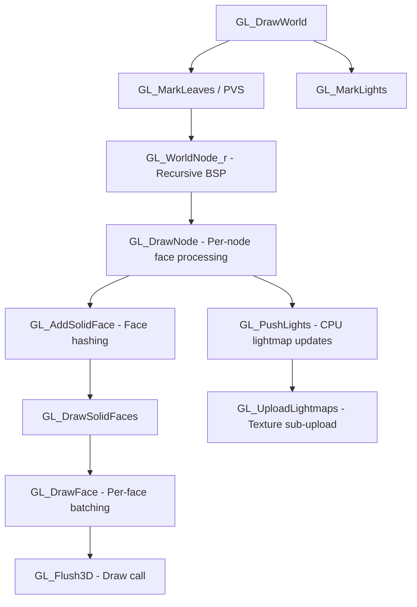

# GL Renderer Efficiency Analysis

## Executive Summary

The WORR-2 GL renderer follows a traditional **CPU-driven immediate mode** approach inherited from Quake II engine architecture. After deep analysis, I've identified **significant CPU overheads** that could be offloaded to the GPU, potentially yielding **2-5x performance improvements** for complex scenes, inspired by Ironwail's modern GPU-driven approach.

---

## Current Architecture Overview

### Rendering Pipeline Flow



---

## CPU Overhead Analysis

### 1. **Dynamic Lightmap Updates** (High Impact)
**Files:** [surf.c](file:///c:/Users/djdac/source/repos/WORR-2/src/rend_gl/surf.c)

The CPU iterates over every surface affected by dynamic lights and recalculates lightmap texels:

```c
// surf.c:136-193
static void add_dynamic_lights(const mface_t *surf) {
    for (i = 0; i < glr.fd.num_dlights; i++) {
        // Per-texel distance calculation
        for (t = 0; t < tmax; t++) {
            for (s = 0; s < smax; s++) {
                // CPU-bound lighting math per texel
                dist = sd + td * 0.5f;
                VectorMA(bl, frac, light->color, bl);
            }
        }
    }
}
```

**CPU Cost:**
- O(lights × surfaces × texels) per frame
- For 32 lights × 1000 visible surfaces × 64 avg texels = **2M+ operations/frame**
- Followed by `glTexSubImage2D` uploads

**Ironwail Solution:** Compute shaders update lightmaps on GPU. Persistent mapped buffers eliminate CPU-GPU sync stalls.

---

### 2. **Mesh Frame Interpolation (Lerping)** (High Impact)
**Files:** [mesh.c](file:///c:/Users/djdac/source/repos/WORR-2/src/rend_gl/mesh.c)

Every animated model has per-vertex lerping done on CPU each frame:

```c
// mesh.c:257-280
static void tess_lerped_plain(const maliasmesh_t *mesh) {
    while (count--) {
        // Per-vertex interpolation
        dst_vert[0] = src_oldvert->pos[0] * oldscale[0] +
                      src_newvert->pos[0] * newscale[0] + translate[0];
        // ... repeat for Y, Z
        get_lerped_normal(dst_vert + 4, src_oldvert, src_newvert);
    }
}
```

**CPU Cost:**
- For 50 entities × 500 avg vertices = **25K vertices/frame** lerped on CPU
- Normal interpolation adds 3 vector ops per vertex

**Ironwail Solution:** Vertex shader lerping with `backlerp` uniform. Vertex data stays static in GPU VRAM.

---

### 3. **BSP Recursive Traversal** (Medium Impact)
**Files:** [world.c](file:///c:/Users/djdac/source/repos/WORR-2/src/rend_gl/world.c)

The BSP tree is traversed recursively on CPU each frame:

```c
// world.c:558-583
static void GL_WorldNode_r(const mnode_t *node, int clipflags) {
    while (node->visframe == glr.visframe) {
        if (!GL_ClipNode(node, &clipflags)) { ... }  // CPU frustum test
        GL_DrawNode(node);  // CPU face iteration
        GL_WorldNode_r(node->children[side], clipflags);  // Recursion
        node = node->children[side ^ 1];
    }
}
```

**CPU Cost:**
- Stack overhead from deep recursion
- Per-node frustum culling (4 plane tests × nodes)
- Cache misses from pointer chasing

**Ironwail Solution:** GPU compute shader performs visibility and frustum culling. Writes visible face indices directly to indirect draw buffer.

---

### 4. **Dynamic Light Marking** (Medium Impact)
**Files:** [world.c](file:///c:/Users/djdac/source/repos/WORR-2/src/rend_gl/world.c)

Each dynamic light recursively marks surfaces it affects:

```c
// world.c:229-260
static void GL_MarkLights_r(const mnode_t *node, const dlight_t *light, uint64_t lightbit) {
    while (node->plane) {
        dot = PlaneDiffFast(light->transformed, node->plane);
        // ... recursive BSP traversal per light
        for (i = 0, face = node->firstface; i < node->numfaces; i++, face++) {
            face->dlightbits |= lightbit;  // Mark surface
        }
    }
}
```

**CPU Cost:**
- O(lights × visible nodes) BSP traversals per frame
- For 32 lights × 500 nodes = **16K node visits/frame**

**Ironwail Solution:** Compute shader performs light culling and surface marking in parallel.

---

### 5. **Per-Face Draw Call Batching** (Medium Impact)
**Files:** [tess.c](file:///c:/Users/djdac/source/repos/WORR-2/src/rend_gl/tess.c)

Faces are batched by texture/state, but batches are flushed frequently:

```c
// tess.c:762-852
static void GL_DrawFace(const mface_t *surf) {
    // Check for batch break
    if (memcmp(tess.texnum, texnum, sizeof(texnum)) ||
        tess.flags != state ||
        tess.numindices + numindices > TESS_MAX_INDICES) {
        GL_Flush3D();  // Draw call!
    }
    // Add indices to batch
    for (i = 0; i < numtris; i++) { ... }
}
```

**CPU Cost:**
- Frequent batch breaks due to texture/state changes
- Each `GL_Flush3D()` = 1 draw call + state changes
- Typical: **100-300 draw calls/frame** for world geometry

**Ironwail Solution:** Bindless textures + multi-draw indirect. One draw call for all world geometry regardless of textures.

---

### 6. **Per-Frame Vertex Buffer Uploads** (Medium Impact)
**Files:** [tess.c](file:///c:/Users/djdac/source/repos/WORR-2/src/rend_gl/tess.c)

The tessellator uploads vertex data per draw:

```c
// tess.c:562-576
void GL_LockArrays(GLsizei count) {
    // Stream upload every flush
    qglBufferData(GL_ARRAY_BUFFER, count * desc->stride, tess.vertices, GL_STREAM_DRAW);
}
```

**CPU Cost:**
- Implicit CPU-GPU sync on each `glBufferData`
- Memory bandwidth for uploading same world geometry repeatedly

**Ironwail Solution:** Persistent mapped buffers (`GL_MAP_PERSISTENT_BIT`) with explicit sync via `GLfence`. World VBO uploaded once at map load.

---

## Ironwail's GPU-Driven Approach

| Feature | WORR-2 Current | Ironwail Modern |
|---------|----------------|-----------------|
| **Visibility Culling** | CPU recursive BSP | GPU compute shader |
| **Frustum Culling** | CPU per-node | GPU compute shader |
| **Light Marking** | CPU BSP traversal per light | GPU compute shader |
| **Lightmap Updates** | CPU texel loop + glTexSubImage | GPU compute shader |
| **Draw Submission** | Multiple glDrawElements | Single glMultiDrawElementsIndirect |
| **Texture Binding** | Per-batch rebind | Bindless textures |
| **Mesh Lerping** | CPU vertex loop | Vertex shader |
| **Buffer Updates** | glBufferData (sync) | Persistent mapping (async) |
| **Required OpenGL** | 2.1+ / 3.3 | **4.3+** (compute, indirect, bindless) |

---

## Expected Performance Gains

### Conservative Estimates

| Optimization | CPU Reduction | Draw Call Reduction | Overall FPS Gain |
|--------------|---------------|---------------------|------------------|
| GPU Mesh Lerping | 30-50% mesh time | — | 5-15% |
| GPU Lightmap Updates | 60-80% lighting time | — | 10-20% |
| Multi-Draw Indirect | — | 80-95% draw calls | 15-30% |
| GPU Visibility | 40-60% traversal time | — | 5-10% |
| Persistent Buffers | 20-40% upload time | — | 5-10% |
| **Combined** | **60-80% CPU reduction** | **85-95% fewer draws** | **40-100%+ (2x)** |

### Realistic Scenarios

| Scene Type | Current FPS (est.) | After Modernization |
|------------|-------------------|---------------------|
| Simple maps (< 1000 faces) | 500+ | 800+ |
| Medium maps (5000 faces, 16 dlights) | 200-300 | 400-600 |
| Complex maps (20K+ faces, 32 dlights) | 60-120 | 150-300 |
| Particle-heavy scenes | 100-150 | 200-400 |

---

## Implementation Complexity Assessment

### Phase 1: Low-Hanging Fruit (Medium Effort, High Gain)

1. **GPU Mesh Lerping**
   - Add `backlerp`, `oldscale`, `newscale` uniforms
   - Upload both keyframes to VBO
   - Lerp in vertex shader
   - **Effort:** 2-3 days
   - **Gain:** 10-20%

2. **Static World VBO**
   - Already partially implemented (`gl_static.world.buffer`)
   - Ensure all world geometry uses static VBO
   - **Effort:** 1 day
   - **Gain:** 5-10%

### Phase 2: Moderate Modernization (High Effort, High Gain)

3. **Persistent Mapped Buffers**
   - Requires `GL_ARB_buffer_storage`
   - Replace `glBufferData` with persistent mapping
   - Add `GLfence` synchronization
   - **Effort:** 3-4 days
   - **Gain:** 10-15%

4. **Multi-Draw Indirect for World**
   - Requires `GL_ARB_multi_draw_indirect`
   - Pre-build indirect command buffer at map load
   - GPU writes visibility mask each frame
   - **Effort:** 1-2 weeks
   - **Gain:** 20-30%

### Phase 3: Full GPU-Driven Pipeline (Very High Effort, Transformative)

5. **Compute Shader Culling**
   - Requires OpenGL 4.3 / Vulkan
   - Frustum, visibility, and light culling on GPU
   - Writes indirect draw commands
   - **Effort:** 2-4 weeks
   - **Gain:** 30-50%

6. **GPU Lightmap Updates**
   - Compute shader writes to lightmap texture array
   - Eliminates CPU lighting loop entirely
   - **Effort:** 1-2 weeks
   - **Gain:** 15-25%

7. **Bindless Textures**
   - Requires `GL_ARB_bindless_texture`
   - Eliminates texture rebinding entirely
   - **Effort:** 1 week
   - **Gain:** 10-15%

---

## Compatibility Considerations

> [!WARNING]
> Full Ironwail-style modernization requires **OpenGL 4.3+**, which excludes:
> - macOS (stuck at 4.1)
> - Older Intel integrated GPUs
> - Some legacy AMD/Nvidia drivers

### Recommended Tiered Approach

1. **Tier 1 (GL 3.3):** GPU lerping, persistent buffers, better batching
2. **Tier 2 (GL 4.3):** Compute culling, multi-draw indirect
3. **Tier 3 (GL 4.5):** Bindless textures, full GPU-driven

The renderer already has tiered capability detection (`gl_config.caps`, `QGL_CAP_*` flags), so this fits the existing architecture.

---

## Conclusion

The current renderer is **well-structured but CPU-bound** by classic Quake-era design patterns. Modernizing it with Ironwail-inspired techniques could yield **2x+ performance** for complex scenes while maintaining compatibility through tiered capability support.

**Immediate wins** (GPU lerping, persistent buffers) are achievable in **~1 week** with **15-25% gains**.

**Full modernization** would require **4-8 weeks** but could deliver **2-3x performance** for demanding content.
