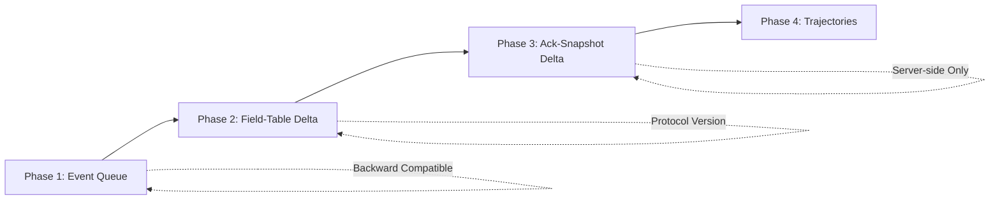

# Q2 to Q3 Event System Migration Plan

## Overview

This document outlines a detailed plan for replacing WORR's Quake 2-based event and packet system with ideas from Quake 3 Arena's superior, more efficient, and robust architecture.

---

## System Comparison

### Quake 2 (Current WORR)

| Aspect | Q2 Implementation |
|--------|-------------------|
| **Entity Events** | Single `event` byte in `entity_state_t`, cleared each frame |
| **Temp Entities** | `svc_temp_entity` messages with explicit broadcast via `gi.multicast()` |
| **Delta Encoding** | Byte-level flags (`U_ORIGIN1`, `U_EVENT`, etc.) per entity field |
| **Snapshot Baseline** | Always deltas against immediately preceding frame |
| **Server Tick Rate** | 10 Hz (vanilla), variable with KEX extensions |
| **Event Reliability** | Events can be lost if packet dropped; no replay mechanism |
| **Player Events** | Mixed into temp entity system or stat changes |

**Key Limitations:**
1. **Single event per entity per frame** - If multiple events occur (e.g., footstep + land), only one can be sent
2. **No event sequence tracking** - No way to detect missed events on client
3. **Baseline-only delta** - Cannot use older acknowledged snapshots as baseline (vulnerable to packet loss chains)
4. **Fixed-width field encoding** - Less efficient than Q3's variable-width bit packing
5. **No trajectory prediction** - Position sent as absolute coordinates each frame

---

### Quake 3 (Target Architecture)

| Aspect | Q3 Implementation |
|--------|-------------------|
| **Entity Events** | `event` + `eventParm` in `entityState_t`, plus **event sequence bits** (`EV_EVENT_BIT1/BIT2`) |
| **Player Events** | Dedicated `events[2]` + `eventParms[2]` + `eventSequence` in `playerState_t` |
| **Delta Encoding** | Field-table based (`netField_t` array), bit-level precision per field |
| **Snapshot Baseline** | Delta against **any acknowledged snapshot**, not just previous |
| **Server Tick Rate** | 20+ Hz default, configurable |
| **Event Reliability** | Event sequence counter detects replay/missed events; `externalEvent` for server-injected events |
| **Trajectory System** | `trajectory_t` for position/angle - client extrapolates between snapshots |

**Key Advantages:**
1. **Event Queue** - `MAX_PS_EVENTS` (2) events can be queued per player per frame
2. **Event Sequence Tracking** - Toggle bits in entity events, full sequence counter in playerState
3. **Acknowledged-Snapshot Delta** - Server tracks which snapshot client confirmed, uses that as baseline
4. **Variable-width Bit Packing** - Floats encoded as 13-bit integers when possible, full 32-bit when needed
5. **Trajectory Extrapolation** - Client can predict entity positions between snapshots

---

## Proposed Changes

### Phase 1: Enhanced Event System

#### 1.1 New Data Structures

```c
// New: Event sequence bits (like Q3's EV_EVENT_BITS)
#define EV_EVENT_BIT1       0x0100
#define EV_EVENT_BIT2       0x0200  
#define EV_EVENT_BITS       (EV_EVENT_BIT1 | EV_EVENT_BIT2)
#define EV_EVENT_MASK       (~EV_EVENT_BITS)

// Enhanced entity_state_t (add to inc/shared/shared.h)
typedef struct entity_state_s {
    // ... existing fields ...
    
    int16_t     event;          // Changed from uint8_t: holds event + sequence bits
    uint8_t     eventParm;      // Event parameter (NEW)
    
    // ... rest of entity state ...
} entity_state_t;
```

#### 1.2 Player State Event Queue

```c
// Constants (in shared.h or protocol.h)
#define MAX_PS_EVENTS       2

// Enhanced pmove_state_t or player_state_t additions
typedef struct {
    // ... existing pmove fields ...
} pmove_state_t;

// New event tracking in player_state_t (already partially present in KEX)
typedef struct {
    // ... existing fields ...
    
    int         eventSequence;          // Incremented for each event
    int         events[MAX_PS_EVENTS];  // Circular event buffer
    int         eventParms[MAX_PS_EVENTS];
    
    int         externalEvent;          // Server-injected events
    int         externalEventParm;
    int         externalEventTime;
    
    // ... rest of player state ...
} player_state_t;
```

#### 1.3 Event API Functions

##### [NEW] `src/game/g_events.c`

```c
// Add predictable event to player (like Q3's BG_AddPredictableEventToPlayerstate)
void G_AddPredictableEventToPlayerstate(int newEvent, int eventParm, player_state_t *ps) {
    ps->events[ps->eventSequence & (MAX_PS_EVENTS - 1)] = newEvent;
    ps->eventParms[ps->eventSequence & (MAX_PS_EVENTS - 1)] = eventParm;
    ps->eventSequence++;
}

// Add external/server event (bypasses prediction)
void G_AddExternalEvent(edict_t *ent, int event, int eventParm) {
    gclient_t *client = ent->client;
    if (!client) return;
    
    client->ps.externalEvent = event;
    client->ps.externalEventParm = eventParm;
    client->ps.externalEventTime = level.time;
}

// Add entity event with sequence tracking
void G_AddEntityEvent(edict_t *ent, int event, int eventParm) {
    int bits;
    
    // Increment event counter (cycles through 0, 1, 2, 3)
    bits = ent->s.event & EV_EVENT_BITS;
    bits = ((bits >> 8) + 1) << 8;
    
    ent->s.event = (event & EV_EVENT_MASK) | bits;
    ent->s.eventParm = eventParm;
}
```

---

### Phase 2: Field-Table Delta Compression

#### 2.1 Network Field Tables

##### [MODIFY] `q2proto/inc/q2proto/q2proto_struct_svc.h` or new header

```c
// Field descriptor for delta compression (inspired by Q3's netField_t)
typedef struct {
    const char  *name;
    uint16_t    offset;
    int8_t      bits;       // 0 = float, negative = signed, positive = unsigned
} q2proto_netfield_t;

// Entity state field table
static const q2proto_netfield_t entityStateFields[] = {
    { "origin[0]",      offsetof(entity_state_t, origin[0]),        0 },  // float
    { "origin[1]",      offsetof(entity_state_t, origin[1]),        0 },
    { "origin[2]",      offsetof(entity_state_t, origin[2]),        0 },
    { "angles[0]",      offsetof(entity_state_t, angles[0]),        0 },
    { "angles[1]",      offsetof(entity_state_t, angles[1]),        0 },
    { "angles[2]",      offsetof(entity_state_t, angles[2]),        0 },
    { "event",          offsetof(entity_state_t, event),            10 },
    { "eventParm",      offsetof(entity_state_t, eventParm),        8 },
    { "modelindex",     offsetof(entity_state_t, modelindex),       16 },
    { "frame",          offsetof(entity_state_t, frame),            16 },
    { "effects",        offsetof(entity_state_t, effects),          32 },
    { "renderfx",       offsetof(entity_state_t, renderfx),         32 },
    // ... more fields ...
};

#define NUM_ENTITY_STATE_FIELDS (sizeof(entityStateFields) / sizeof(entityStateFields[0]))
```

#### 2.2 Enhanced MSG_WriteDeltaEntity

##### [MODIFY] `src/common/msg.c` or `q2proto/src/q2proto_server.c`

```c
// New: Field-table based delta encoding
void MSG_WriteDeltaEntityFieldTable(msg_t *msg, 
                                     const entity_state_t *from,
                                     const entity_state_t *to,
                                     bool force) {
    int i, lc = 0;
    const q2proto_netfield_t *field;
    
    // Find last changed field
    for (i = 0, field = entityStateFields; i < NUM_ENTITY_STATE_FIELDS; i++, field++) {
        const int *fromF = (int*)((byte*)from + field->offset);
        const int *toF = (int*)((byte*)to + field->offset);
        if (*fromF != *toF) {
            lc = i + 1;
        }
    }
    
    if (lc == 0 && !force) {
        return;  // No changes
    }
    
    // Write entity number and change count
    MSG_WriteShort(msg, to->number);
    MSG_WriteByte(msg, lc);
    
    // Write changed fields with 1-bit change flags
    for (i = 0, field = entityStateFields; i < lc; i++, field++) {
        const int *fromF = (int*)((byte*)from + field->offset);
        const int *toF = (int*)((byte*)to + field->offset);
        
        if (*fromF == *toF) {
            MSG_WriteBits(msg, 0, 1);  // No change
            continue;
        }
        
        MSG_WriteBits(msg, 1, 1);  // Changed
        
        if (field->bits == 0) {
            // Float: try small integer encoding first
            float fullFloat = *(float*)toF;
            int trunc = (int)fullFloat;
            
            if (fullFloat == 0.0f) {
                MSG_WriteBits(msg, 0, 1);  // Zero
            } else if (trunc == fullFloat && trunc >= -4096 && trunc < 4096) {
                MSG_WriteBits(msg, 1, 1);
                MSG_WriteBits(msg, 0, 1);  // Small int
                MSG_WriteBits(msg, trunc + 4096, 13);
            } else {
                MSG_WriteBits(msg, 1, 1);
                MSG_WriteBits(msg, 1, 1);  // Full float
                MSG_WriteBits(msg, *toF, 32);
            }
        } else {
            // Integer field
            MSG_WriteBits(msg, *toF, abs(field->bits));
        }
    }
}
```

---

### Phase 3: Acknowledged-Snapshot Delta System

#### 3.1 Server-Side Snapshot History

##### [MODIFY] `inc/server/server.h`

```c
// Snapshot tracking per client
#define SNAPSHOT_BACKUP     32
#define SNAPSHOT_MASK       (SNAPSHOT_BACKUP - 1)

typedef struct {
    bool        valid;
    int         framenum;
    int         first_entity;
    int         num_entities;
    player_state_t ps;
    byte        areabits[MAX_MAP_AREA_BYTES];
    int         areabytes;
} client_snapshot_t;

typedef struct client_s {
    // ... existing fields ...
    
    // New: Snapshot history for acknowledged-delta compression
    client_snapshot_t   snapshots[SNAPSHOT_BACKUP];
    int                 deltaMessage;       // Last acknowledged snapshot
    int                 lastAckedSnapshot;  // Client-confirmed frame
    
    // ... rest of client struct ...
} client_t;
```

#### 3.2 Snapshot Delta from Acknowledged Frame

##### [MODIFY] `src/server/sv_send.c`

```c
void SV_WriteSnapshotToClient(client_t *client, sizebuf_t *msg) {
    client_snapshot_t *frame, *oldframe;
    int lastframe;
    
    // Current frame
    frame = &client->snapshots[sv.framenum & SNAPSHOT_MASK];
    
    // Try to delta from client's last acknowledged snapshot
    if (client->deltaMessage <= 0 || client->state != cs_spawned) {
        // Client asking for retransmit or not fully connected
        oldframe = NULL;
        lastframe = 0;
    } else if (sv.framenum - client->deltaMessage >= SNAPSHOT_BACKUP - 3) {
        // Client acknowledgment too old
        Com_DPrintf("%s: Delta request from out of date packet.\n", client->name);
        oldframe = NULL;
        lastframe = 0;
    } else {
        // Valid delta from acknowledged snapshot
        oldframe = &client->snapshots[client->deltaMessage & SNAPSHOT_MASK];
        lastframe = sv.framenum - client->deltaMessage;
        
        // Verify entities haven't rolled off
        if (!oldframe->valid) {
            oldframe = NULL;
            lastframe = 0;
        }
    }
    
    // Write frame header
    MSG_WriteByte(msg, svc_frame);
    MSG_WriteLong(msg, sv.framenum);
    MSG_WriteByte(msg, lastframe);  // Delta reference
    
    // Delta encode playerstate and entities...
}
```

---

### Phase 4: Trajectory-Based Motion (Optional)

> [!WARNING]
> This is a **major architectural change** that affects client prediction, rendering interpolation, and game physics. Consider implementing as a separate phase after core event system migration.

#### 4.1 Trajectory Structure

```c
typedef enum {
    TR_STATIONARY,
    TR_INTERPOLATE,     // Non-parametric interpolation
    TR_LINEAR,          // trBase + time * trDelta  
    TR_LINEAR_STOP,     // Linear with stop time
    TR_SINE,            // Oscillating
    TR_GRAVITY          // Ballistic with gravity
} trType_t;

typedef struct {
    trType_t    trType;
    int         trTime;         // Start time
    int         trDuration;     // Duration for LINEAR_STOP
    vec3_t      trBase;         // Starting position
    vec3_t      trDelta;        // Velocity/direction
} trajectory_t;

// Enhanced entity_state_t with trajectories
typedef struct entity_state_s {
    int             number;
    int             eType;
    int             eFlags;
    
    trajectory_t    pos;        // Position trajectory (replaces origin)
    trajectory_t    apos;       // Angle trajectory (replaces angles)
    
    // ... other fields ...
} entity_state_t;
```

---

## Migration Strategy

### Incremental Approach



### Backward Compatibility

| Phase | Compatibility Strategy |
|-------|----------------------|
| **Phase 1** | Fallback to single-event for old clients; `GMF_PROTOCOL_EXTENSIONS` flag |
| **Phase 2** | Protocol version check; legacy `MSG_WriteDeltaEntity` for old protocols |
| **Phase 3** | Server-side only change; transparent to clients |
| **Phase 4** | Requires protocol bump; major version change |

---

## Files to Modify

### Core Headers
| File | Changes |
|------|---------|
| `inc/shared/shared.h` | Add event queue to `entity_state_t`, trajectory types |
| `inc/shared/game.h` | Update `player_state_t` with event arrays |
| `inc/common/protocol.h` | Add `EV_EVENT_BITS` constants, new `svc_*` if needed |
| `inc/server/server.h` | Add `client_snapshot_t`, snapshot history to `client_t` |

### Protocol Implementation
| File | Changes |
|------|---------|
| `q2proto/inc/q2proto/q2proto_struct_svc.h` | Add `netField_t` tables |
| `q2proto/src/q2proto_server.c` | Field-table delta encoding |
| `src/common/msg.c` | `MSG_WriteDeltaEntityFieldTable()` |

### Server
| File | Changes |
|------|---------|
| `src/server/sv_send.c` | Acknowledged-snapshot delta logic |
| `src/server/sv_game.c` | Snapshot history management |

### Game DLL
| File | Changes |
|------|---------|
| [NEW] `src/game/g_events.c` | Event queue API functions |
| `src/game/g_utils.c` | Update event emission to use new API |
| `src/game/g_mover.c`, `g_weapon.c`, etc. | Replace `gi.WriteByte(svc_temp_entity)` patterns with event API |

### Client
| File | Changes |
|------|---------|
| `src/client/cl_parse.c` | Parse new delta format, event queue |
| `src/client/cl_ents.c` | Handle event sequence tracking |
| `src/client/cl_effects.c` | Process events from queue |

---

## Verification Plan

### Automated Testing

> [!NOTE]
> No existing automated networking tests found in WORR. New tests should be added.

1. **Unit Tests for Delta Encoding**
   - Add test cases in `q2proto/tests/` for field-table encoding
   - Test float compression (zero, small int, full float paths)
   - Test event sequence bit cycling

2. **Protocol Compatibility Tests**
   - Verify vanilla Q2 client can still connect (fallback path)
   - Verify Q2PRO/R1Q2 protocol extensions still work

### Manual Verification

1. **Basic Connectivity**
   - [ ] Start dedicated server
   - [ ] Connect with modified client
   - [ ] Verify entities visible and moving correctly

2. **Event System**
   - [ ] Trigger footstep events (walk on metal, normal ground)
   - [ ] Verify sounds play on client
   - [ ] Fire weapon rapidly - verify all muzzle flashes appear
   - [ ] Land from jump while firing - verify both events play

3. **Packet Loss Simulation**
   - [ ] Use `net_droppackets` cvar (if exists) or firewall rules
   - [ ] Verify acknowledged-snapshot delta recovers gracefully
   - [ ] Check no entity rubber-banding under 10-20% packet loss

4. **Demo Recording/Playback**
   - [ ] Record demo with new event system
   - [ ] Playback demo - verify all events replay correctly
   - [ ] Verify event sequence tracking prevents double-play

---

## WORR Protocol Outline for q2proto

> [!IMPORTANT]
> **Yes, this change necessitates a new network protocol.** Phase 2+ changes are incompatible with existing Q2 protocols. A dedicated "WORR" protocol should be added to q2proto.

### Why a New Protocol?

| Phase | Protocol Impact |
|-------|----------------|
| Phase 1 | Could use `GMF_PROTOCOL_EXTENSIONS` flag with existing protocols |
| Phase 2 | **Breaking**: Field-table delta encoding incompatible with byte-flags |
| Phase 3 | Transparent (server-side only snapshot tracking) |
| Phase 4 | **Breaking**: Trajectory replaces origin/angles structure |

### Protocol Registration

#### [MODIFY] `q2proto/inc/q2proto/q2proto_protocol.h`

```c
typedef enum q2proto_protocol_e {
    // ... existing protocols ...
    Q2P_PROTOCOL_KEX,
    
    /// WORR protocol - Q3-inspired event system and field-table deltas
    Q2P_PROTOCOL_WORR,
    /// WORR demo format
    Q2P_PROTOCOL_WORR_DEMO,

    Q2P_NUM_PROTOCOLS
} q2proto_protocol_t;
```

#### [MODIFY] `q2proto/src/q2proto_internal_protocol.h`

```c
// WORR Protocol version (4000+ range to avoid collision)
#define PROTOCOL_WORR           4000
#define PROTOCOL_WORR_DEMO      4001

// WORR Protocol revision numbers
#define PROTOCOL_VERSION_WORR_INITIAL       1000
#define PROTOCOL_VERSION_WORR_TRAJECTORIES  1001  // Phase 4
#define PROTOCOL_VERSION_WORR_CURRENT       1000
```

### New Server Commands

```c
/// WORR-specific server command IDs (start at 40)
enum worr_svc_cmds {
    svc_worr_snapshot = 40,         // Field-table encoded snapshot
    svc_worr_playerstate,           // Field-table encoded player state
    svc_worr_entity_event,          // Entity event with sequence
    svc_worr_player_event,          // Player event from queue
    svc_worr_trajectory,            // Phase 4: trajectory update
};

/// WORR entity delta bits (extended)
#define U_WORR_EVENT_SEQ    BIT_ULL(36)  // Event sequence bits present
#define U_WORR_EVENTPARM    BIT_ULL(37)  // Event parameter present
#define U_WORR_TRAJECTORY   BIT_ULL(38)  // Phase 4: pos trajectory

/// WORR player state delta bits (extended)
#define PS_WORR_EVENTSEQ      BIT(18)  // eventSequence changed
#define PS_WORR_EVENTS        BIT(19)  // events[] array changed  
#define PS_WORR_EXTERNALEVENT BIT(21)  // externalEvent changed
```

### New Protocol Handler Files

| File | Purpose |
|------|---------|
| [NEW] `q2proto/src/q2proto_proto_worr.h` | Protocol handler declarations |
| [NEW] `q2proto/src/q2proto_proto_worr.c` | Field-table delta, event queue encoding |

#### Key Functions in `q2proto_proto_worr.c`

```c
// Field-table entity delta (Q3-style)
q2proto_error_t q2proto_worr_server_write_entity_delta_fieldtable(
    q2proto_servercontext_t *context, uintptr_t io_arg,
    uint16_t entnum,
    const q2proto_entity_state_delta_t *from,
    const q2proto_entity_state_delta_t *to);

// Player event queue encoding
q2proto_error_t q2proto_worr_server_write_player_events(
    q2proto_servercontext_t *context, uintptr_t io_arg,
    const q2proto_svc_playerstate_t *ps);

// Protocol version mapping
q2proto_error_t q2proto_worr_init_servercontext(
    q2proto_servercontext_t *context,
    const q2proto_connect_t *connect_info);
```

### Game API Update

#### [MODIFY] `q2proto/inc/q2proto/q2proto_game_api.h`

```c
typedef enum q2proto_game_api_e {
    Q2PROTO_GAME_VANILLA,
    Q2PROTO_GAME_Q2PRO_EXTENDED,
    Q2PROTO_GAME_Q2PRO_EXTENDED_V2,
    Q2PROTO_GAME_RERELEASE,
    Q2PROTO_GAME_WORR,  // NEW: WORR game API
} q2proto_game_api_t;
```

### Protocol Features Summary

| Feature | WORR Protocol |
|---------|--------------|
| **Base** | Derived from Q2PRO/KEX with Q3 enhancements |
| **Entity Deltas** | Field-table based (`netField_t`) |
| **Float Encoding** | 13-bit small int or 32-bit full |
| **Entity Events** | Sequence bits + eventParm |
| **Player Events** | Queue (`events[2]`, `eventSequence`) |
| **Snapshot Delta** | Against any acknowledged frame |
| **Multicast** | Float positions (like KEX) |

---

## Risk Assessment

| Risk | Likelihood | Impact | Mitigation |
|------|-----------|--------|------------|
| Breaking existing demos | Medium | High | Keep legacy parse path; version tag demos |
| Performance regression (bit ops) | Low | Medium | Profile MSG_WriteBits; cache field offsets |
| Client/server desync | Medium | High | Extensive playtesting; sequence validation |
| Breaking mod compatibility | High | Medium | Maintain game API; add extension interface |
